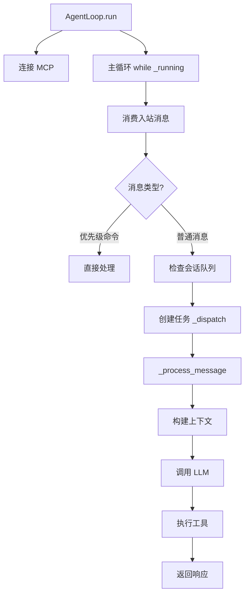

# 问题：介绍一下 `AgentLoop.run` 的执行流程

`AgentLoop.run` 是 nanobot 的核心消息处理循环，负责持续监听消息总线并分发处理。

## 执行流程概览



## 详细执行步骤

### 1. 初始化阶段
`run()` 方法首先设置运行状态并连接 MCP 服务器：
```python
async def run(self) -> None:
    self._running = True
    await self._connect_mcp()
```

### 2. 主循环处理
进入 `while self._running` 循环，持续监听消息 ：
- 使用 `asyncio.wait_for` 设置 1 秒超时
- 超时时触发 `auto_compact.check_expired()` 检查过期会话
- 处理 `CancelledError` 和其他异常

### 3. 消息分发逻辑

#### 优先级命令处理
检查是否为优先级命令（如 `/stop`），直接处理 ：
```python
if self.commands.is_priority(raw):
    ctx = CommandContext(msg=msg, session=None, key=msg.session_key, raw=raw, loop=self)
    result = await self.commands.dispatch_priority(ctx)
```

#### 会话路由
计算有效的会话键（考虑 `unifiedSession` 设置） ：
- 如果会话已有活跃任务，路由到待处理队列
- 否则创建新的异步任务处理

### 4. 任务分发 (_dispatch)
`_dispatch` 方法确保同会话消息串行处理 ：
- 获取会话锁确保串行处理
- 设置并发控制门
- 注册待处理队列用于中途消息注入

### 5. 消息处理 (_process_message)
实际的消息处理逻辑 ：
- 提取文档内容
- 处理系统消息
- 检查斜杠命令
- 构建上下文和消息历史
- 调用 `_run_agent_loop` 执行 LLM 交互

### 6. Agent 循环执行
`_run_agent_loop` 是核心的 LLM 交互循环 ：
- 设置钩子（hooks）用于生命周期事件
- 处理流式响应
- 调用 `AgentRunner.run` 执行实际的 LLM 查询和工具执行
- 返回最终内容、使用的工具等信息

## 关键特性

### 并发控制
- 使用 `_concurrency_gate` 限制最大并发请求数
- 每个会话有独立的锁确保消息顺序

### 流式响应支持
- 检查 `_wants_stream` 元数据
- 通过 `on_stream` 和 `on_stream_end` 回调处理流式输出

### 会话管理
- 自动压缩过期会话
- 支持统一会话模式

## Notes

- `AgentLoop.run` 是 gateway 模式的核心，在 CLI 模式下通过 `process_direct` 直接处理消息
- 整个流程设计为高响应性，支持 `/stop` 等命令中断长时间运行的任务
- MCP（Model Context Protocol）服务器在启动时连接，用于扩展工具能力

Wiki pages you might want to explore:
- [Overview (HKUDS/nanobot)](/wiki/HKUDS/nanobot#1)
- [SDK Quick Start & API Reference (HKUDS/nanobot)](/wiki/HKUDS/nanobot#13.1)
