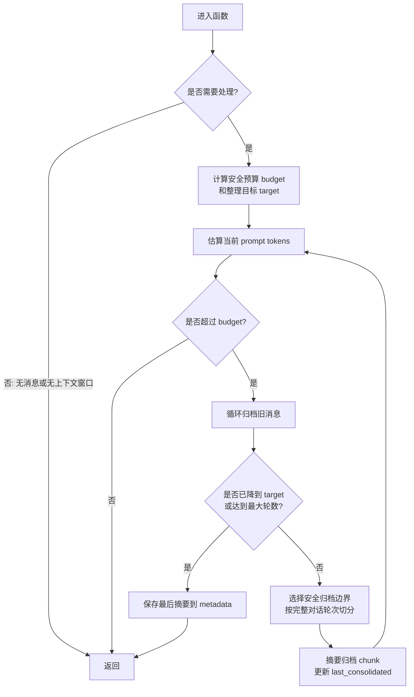

# Consolidator 概述

Consolidator 是 nanobot 内存系统的核心组件，负责在对话历史接近上下文窗口限制时自动压缩旧消息。

## 核心职责

Consolidator 实现轻量级的基于令牌预算的内存压缩：
- 监控会话的令牌使用量
- 当超过阈值时归档旧消息
- 将归档内容总结并保存到 `history.jsonl`
- 维护消息偏移量而非删除消息

## 工作流程

1. **触发检查**：在每次消息处理前检查令牌使用量
2. **边界选择**：找到安全的归档边界，避免切断对话回合
3. **批量处理**：每次最多处理 60 条消息
4. **LLM 总结**：调用 LLM 生成消息摘要
5. **持久化**：保存到 `history.jsonl` 并更新偏移量

## 安全机制

- **用户回合对齐**：只在用户消息边界处切割
- **原始备份**：LLM 失败时进行原始转储
- **最大轮次限制**：最多执行 5 轮归档

## 主要方法

### 方法01：`maybe_consolidate_by_tokens`
这是主要的触发方法，循环归档消息直到令牌数低于目标值：

```python
async def maybe_consolidate_by_tokens(self, session: Session) -> None:
    """Loop: archive old messages until prompt fits within safe budget."""
```


`maybe_consolidate_by_tokens`执行流程：



这个流程图可以理解为一句话：

> 如果当前 prompt 超过安全预算，就反复把最旧的完整对话轮次摘要归档，直到 token 降到目标值附近，最后把最新摘要保存起来供后续上下文使用。


### 方法02：`archive`
实际执行归档操作，通过 LLM 总结消息并追加到历史文件。

### 方法03：`pick_consolidation_boundary`
选择合适的用户回合边界进行归档，确保对话完整性。

`pick_consolidation_boundary` 的作用是：在旧消息里找一个“适合归档到这里为止”的边界。

它不直接归档，只负责回答一个问题：

> 为了移除大约 `tokens_to_remove` 个 token，应该把 `session.messages` 从 `last_consolidated` 开始归档到哪个位置？

返回值是 `tuple[int, int] | None`：

- 第一个值 `idx`：归档结束位置，也就是后面会归档 `session.messages[start:idx]`
- 第二个值 `removed_tokens`：归档到这个位置大约能移除多少 token
- `None`：没有可归档的消息，或者传入的 `tokens_to_remove <= 0`

它为什么只在 `role == "user"` 的位置设边界？因为一条新的 `user` 消息通常代表一轮新对话开始。把边界放在 user 消息之前，就能尽量保证归档的是完整的旧问答，而不是把一次 user/assistant 交互拆开。

举个例子：

```text
0 user: 问题 A
1 assistant: 回答 A
2 user: 问题 B
3 assistant: 回答 B
4 user: 问题 C
```

如果返回 `(2, 约若干token)`，调用方会归档：

```python
session.messages[start:2]
```

也就是归档 `问题 A + 回答 A`，保留从 `问题 B` 开始的内容。

一句话总结：`pick_consolidation_boundary` 是找边界，“找一个尽量够减 token、又不拆散对话轮次的归档截止点”。


### 方法04：`estimate_session_prompt_tokens`
该方法的作用是：估算当前会话如果正常发给模型，整个 prompt 大概会占多少 token。

它不是简单统计 `session.messages` 的文本长度，而是走一遍真实构造 prompt 的流程。

它主要做 3 件事：

1. `history = session.get_history(max_messages=0)`

   取当前会话历史。这里会受 `session.last_consolidated` 等会话状态影响，所以估算的是“整理后的会话视图”，不是原始全部消息。

2. 调用 `self._build_messages(...)`

   构造一份探测用的消息列表 `probe_messages`。这里传入了：

   - `history`：会话历史
   - `current_message="[token-probe]"`：占位当前消息
   - `channel` / `chat_id`：从 `session.key` 拆出来的上下文信息
   - `session_summary`：可选的会话摘要

   这样估算会包含系统提示、历史消息、摘要等实际 prompt 结构。

3. 调用 `estimate_prompt_tokens_chain(...)`

   用当前 `provider`、`model`、`probe_messages` 和工具定义来估算 token 数。

返回值是：

```python
tuple[int, str]
```

也就是：

- 第一个值：估算出来的 token 数
- 第二个值：估算来源或方法，例如用的是哪个 tokenizer / provider 估算路径

它在 `maybe_consolidate_by_tokens` 里很关键：函数会根据这个估算值判断当前 prompt 是否超过安全预算，是否需要归档旧消息。

### 方法05：`get_history`
`get_history` 的作用是：从当前 `Session` 里取出“适合发给 LLM 的历史消息”。

它不会直接返回全部 `self.messages`，而是做了几层过滤和修正：

流程可以理解为：

1. 先跳过已经归档的消息

   ```python
   unconsolidated = self.messages[self.last_consolidated:]
   ```

   `last_consolidated` 表示前面多少条消息已经被整理/归档到记忆文件里了，所以这里从它之后开始取。

2. 只保留最近 `max_messages` 条

   ```python
   sliced = unconsolidated[-max_messages:]
   ```

   默认最多取 500 条，避免历史太长。

3. 尽量从 `user` 消息开始

   ```python
   for i, message in enumerate(sliced):
       if message.get("role") == "user":
           sliced = sliced[i:]
           break
   ```

   这样可以避免历史一上来就是 assistant 的半截回答，尽量保证对话轮次完整。

4. 去掉开头孤立的 tool result

   ```python
   start = find_legal_message_start(sliced)
   ```

   有些模型要求工具调用消息必须成对出现：assistant 发起 `tool_calls`，后面才有 tool 结果。如果历史从 tool 结果开始，就是非法结构，所以这里会修正开头位置。

5. 只输出 LLM 需要的字段

   基础字段是：

   - `role`
   - `content`

   如果存在，也会保留：

   - `tool_calls`
   - `tool_call_id`
   - `name`
   - `reasoning_content`

一句话总结：`get_history` 是把 session 里的原始消息整理成“未归档、最近、从合理边界开始、字段干净”的 LLM 输入历史。

## 在 AgentLoop 中的集成

Consolidator 在 AgentLoop 初始化时创建，并在消息处理过程中自动调用。

## Notes

- Consolidator 只影响发送给模型的消息视图，不改变实际存储的会话历史
- 与 AutoCompact 不同，Consolidator 是被动触发（基于令牌限制）
- 测试覆盖了各种场景，包括空会话、边界对齐等
