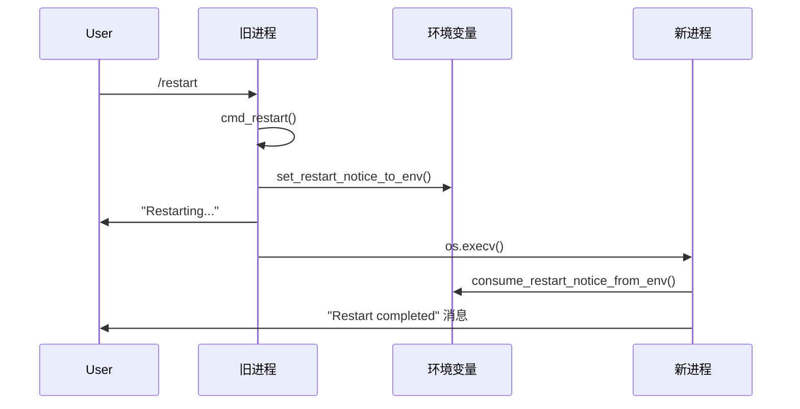

# 重启机制

nanobot 的重启机制是一个通过环境变量传递通知信息的进程重启系统，确保重启后能向正确的频道发送完成通知。

## 核心组件

### 1. 重启触发器

在 `cmd_restart` 函数中，当用户发送 `/restart` 命令时，会调用此函数保存当前会话信息，属于优先级命令，可立即中断当前任务

```python
async def cmd_restart(ctx: CommandContext) -> OutboundMessage:
    """Restart the process in-place via os.execv."""
    msg = ctx.msg
    set_restart_notice_to_env(channel=msg.channel, chat_id=msg.chat_id)
    # ... 后续执行 os.execv 重启
```

### 2. 环境变量设置

`set_restart_notice_to_env` 在重启前写入三个环境变量：

- `NANOBOT_RESTART_NOTIFY_CHANNEL` - 频道标识
- `NANOBOT_RESTART_NOTIFY_CHAT_ID` - 聊天ID
- `NANOBOT_RESTART_STARTED_AT` - 重启时间戳

### 3. 环境变量消费

`consume_restart_notice_from_env` 函数用于在 nanobot 重启后消费（读取并清除）环境变量中的重启通知信息。

这个函数是 nanobot 重启机制的核心组件，主要作用是：

1. 读取重启通知：从环境变量中读取重启前设置的通知信息（包括频道、聊天ID和重启时间）
2. 返回通知对象：返回一个 `RestartNotice` 对象，包含重启相关的元数据
3. 清理环境变量：消费后清除这些环境变量，避免重复处理

## 重启流程



## 不同模式的通知处理

### CLI 模式

在 `nanobot agent` 命令启动时检查重启通知并显示消息。

### Gateway 模式

`ChannelManager` 在启动时检查重启通知，向原始频道发送消息。

## 技术特点

1. **进程替换**：使用 `os.execv` 替换当前进程，保持 PID 不变
2. **环境变量继承**：子进程自动继承父进程的环境变量
3. **一次性消费**：使用 `pop()` 清除环境变量，避免重复处理
4. **异步延迟**：重启前等待 1 秒确保消息发送

## 测试验证

重启机制包含完整的测试覆盖，验证命令拦截、环境变量设置和进程替换：

## Notes

- 重启机制确保用户能收到重启完成通知，提升用户体验
- 优先级命令设计确保即使 agent 卡死也能响应重启命令
- 环境变量使用 `NANOBOT_` 前缀避免冲突
- 时间戳记录允许计算并显示重启耗时

Wiki pages you might want to explore:

- [Command Router & Built-in Commands (HKUDS/nanobot)](/wiki/HKUDS/nanobot#9.1)
- [CLI Reference (HKUDS/nanobot)](/wiki/HKUDS/nanobot#9)

Wiki pages you might want to explore:

- [Overview (HKUDS/nanobot)](/wiki/HKUDS/nanobot#1)
- [Command Router & Built-in Commands (HKUDS/nanobot)](/wiki/HKUDS/nanobot#9.1)
