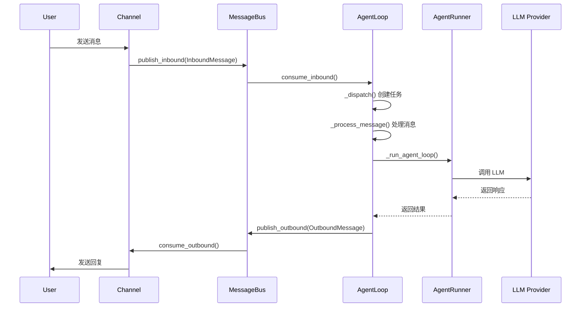

# 使用nanobot gateway启动，用户发送消息后的执行流程

使用 `nanobot gateway` 启动后，用户消息的执行流程如下：

## 核心流程概览



## 详细执行步骤

### 1. Gateway 启动初始化

`nanobot gateway` 命令创建核心组件：
- 创建 `MessageBus` 用于消息路由
- 创建 `AgentLoop` 作为核心处理引擎
- 创建 `ChannelManager` 管理各个聊天渠道
- 启动所有启用的 channel

### 2. 消息接收与路由

用户发送消息后，Channel 通过 `_handle_message()` 将消息发布到总线：
```python
await self._handle_message(
    sender_id=sender_id,
    chat_id=chat_id,
    content=text,
    media=media,
)
```

### 3. AgentLoop 主循环处理

`AgentLoop.run()` 持续监听入站消息：
- 使用 `asyncio.wait_for` 带超时消费消息
- 检查是否为优先级命令（如 `/stop`）
- 计算有效的会话键（考虑 unifiedSession）

### 4. 消息分发机制

对于普通消息，AgentLoop 检查是否有活跃的待处理队列（mid-turn injection）：
- 如果会话正在处理中，消息注入到待处理队列
- 否则创建新的异步任务处理消息

### 5. 任务执行 (_dispatch)

`_dispatch()` 方法确保同会话消息串行处理：
- 获取会话锁
- 创建待处理队列用于中途消息注入
- 调用 `_process_message()` 处理消息

### 6. 消息处理核心 (_process_message)

`_process_message()` 执行实际的消息处理逻辑：
1. 提取文档内容（处理媒体文件）
2. 检查斜杠命令
3. 调用 Consolidator 压缩历史（如需要）
4. 构建上下文和消息历史
5. 调用 `_run_agent_loop()` 执行 LLM 交互

### 7. Agent 执行循环

`_run_agent_loop()` 通过 AgentRunner 执行：
- 设置钩子处理流式响应
- 调用 `AgentRunner.run()` 执行 LLM 查询和工具调用
- 处理中途消息注入
- 返回最终内容

### 8. 响应发送

处理完成后，响应通过 MessageBus 发布：
```python
if response is not None:
    await self.bus.publish_outbound(response)
```

Channel 从出站队列消费消息并发送给用户。

## 关键特性

- **并发控制**：每个会话有独立锁，不同会话可并发处理
- **中途注入**：支持在 AI 处理过程中接收新消息
- **流式响应**：支持实时流式输出 
- **会话管理**：自动保存对话历史和管理会话状态

## Notes

- 整个流程设计为高响应性，支持 `/stop` 等命令中断长时间运行的任务
- MessageBus 作为异步消息队列解耦了 Channel 和 AgentLoop
- 统一会话模式下，所有渠道共享同一个会话上下文

Wiki pages you might want to explore:
- [Overview (HKUDS/nanobot)](/wiki/HKUDS/nanobot#1)
- [Agent System (HKUDS/nanobot)](/wiki/HKUDS/nanobot#4)

Wiki pages you might want to explore:
- [Overview (HKUDS/nanobot)](/wiki/HKUDS/nanobot#1)
- [Glossary (HKUDS/nanobot)](/wiki/HKUDS/nanobot#14)
