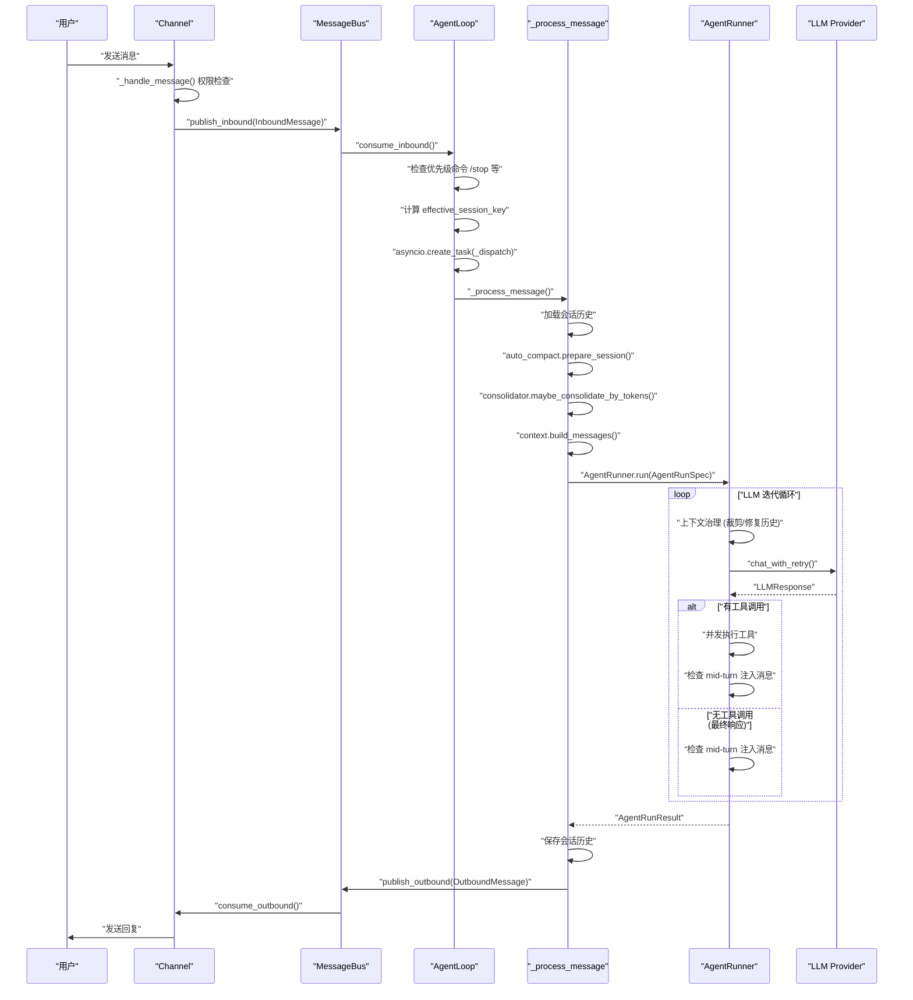

# 使用nanobot gateway启动，用户发送消息后的详细流程

以下是 `nanobot gateway` 启动后，用户发送消息的完整详细执行流程：

---

## 整体架构



---

## 第一阶段：Gateway 启动初始化

`nanobot gateway` 命令执行时，创建以下核心组件：

- `MessageBus` — 异步消息队列，解耦 Channel 和 AgentLoop
- `AgentLoop` — 核心处理引擎
- `ChannelManager` — 管理所有启用的渠道（Telegram、Discord 等）
- `CronService` — 定时任务服务
- `HeartbeatService` — 心跳服务

ChannelManager 启动所有启用的 Channel，每个 Channel 开始监听对应平台的消息。

---

## 第二阶段：Channel 接收消息并发布到总线

用户在 Telegram/Discord 等平台发送消息后，Channel 的 `start()` 方法（各平台实现不同）接收到消息，调用基类的 `_handle_message()` 方法：

1. **权限检查**：`is_allowed(sender_id)` 验证发送者是否在 `allowFrom` 列表中
2. **构建 InboundMessage**：包含 `channel`、`sender_id`、`chat_id`、`content`、`media`、`metadata`
3. **流式标记**：如果 Channel 支持流式响应，在 metadata 中设置 `_wants_stream: True`
4. **发布到总线**：`await self.bus.publish_inbound(msg)`

---

## 第三阶段：AgentLoop 主循环处理

`AgentLoop.run()` 持续运行，消费入站消息：

```
while _running:
    ├── asyncio.wait_for(bus.consume_inbound(), timeout=1.0)
    │   ├── 超时 → auto_compact.check_expired() 检查过期会话
    │   └── 成功 → 获得 InboundMessage
    ├── 检查优先级命令（/stop 等）
    │   └── 是 → 直接处理并发布响应，continue
    ├── 计算 effective_key（考虑 unifiedSession）
    ├── 检查 _pending_queues[effective_key] 是否存在
    │   └── 存在（会话正在处理中）→ mid-turn injection，put_nowait() 到队列，continue
    └── asyncio.create_task(_dispatch(msg))  ← 创建异步任务
```

---

## 第四阶段：_dispatch() — 会话隔离与任务管理

`_dispatch()` 确保同一会话的消息串行处理，不同会话可并发：

1. **获取会话锁**：`lock = self._session_locks.setdefault(session_key, asyncio.Lock())`
2. **并发控制门**：`gate = self._concurrency_gate`（默认最多 3 个并发请求）
3. **注册待处理队列**：`pending = asyncio.Queue(maxsize=20)`，注册到 `_pending_queues[session_key]`
4. **设置流式回调**：如果 `_wants_stream`，设置 `on_stream` 和 `on_stream_end` 回调
5. **调用 `_process_message()`**
6. **发布响应**：`await self.bus.publish_outbound(response)`
7. **清理**：任务结束后，将待处理队列中剩余消息重新发布到总线（不丢失）

---

## 第五阶段：_process_message() — 核心消息处理

`_process_message()` 执行实际的消息处理逻辑：

```
_process_message()
├── 提取文档内容（PDF/图片等媒体文件）
├── 加载会话：sessions.get_or_create(session_key)
├── 恢复运行时检查点（进程崩溃恢复）
├── auto_compact.prepare_session() — 注入 AutoCompact 摘要
├── 检查斜杠命令（/new、/history 等）
│   └── 是命令 → 直接返回命令结果
├── consolidator.maybe_consolidate_by_tokens() — 压缩历史（如超出 token 预算）
├── 设置工具上下文（channel、chat_id、message_id）
├── session.get_history() — 加载历史消息
├── context.build_messages() — 构建完整消息列表（系统提示 + 历史 + 当前消息）
├── 提前持久化用户消息（防止进程崩溃丢失）
└── _run_agent_loop() — 执行 LLM 交互
```

---

## 第六阶段：_run_agent_loop() — 准备 AgentRunner

`_run_agent_loop()` 设置钩子和回调，然后调用 AgentRunner：

1. **创建 `_LoopHook`**：处理进度回调、流式输出、工具执行事件
2. **创建 `_checkpoint` 回调**：在关键状态保存运行时检查点（用于崩溃恢复）
3. **创建 `_drain_pending` 回调**：从待处理队列取出 mid-turn 注入消息
4. **调用 `AgentRunner.run(AgentRunSpec(...))`**

---

## 第七阶段：AgentRunner.run() — LLM 交互与工具执行

`AgentRunner.run()` 执行核心的 LLM 循环：

```
for iteration in range(max_iterations):
    ├── 上下文治理（每次迭代前）
    │   ├── _drop_orphan_tool_results() — 清理孤立工具结果
    │   ├── _backfill_missing_tool_results() — 补充缺失工具结果
    │   ├── _microcompact() — 微压缩
    │   ├── _apply_tool_result_budget() — 应用工具结果预算
    │   ├── _snip_history() — 裁剪历史以适应上下文窗口
    │   └── 再次清理孤立结果（裁剪可能产生新孤立）
    ├── _request_model() — 调用 LLM Provider
    │   ├── 非流式：chat_with_retry()
    │   └── 流式：chat_stream_with_retry()，实时推送 delta
    ├── 响应有工具调用？
    │   ├── 是 → 执行工具（支持并发）
    │   │   ├── 发出检查点（awaiting_tools）
    │   │   ├── tools.execute() 并发执行所有工具
    │   │   ├── 发出检查点（tools_completed）
    │   │   ├── 检查 mid-turn 注入消息
    │   │   └── continue（下一次迭代，带工具结果再次调用 LLM）
    │   └── 否 → 处理最终响应
    │       ├── hook.finalize_content() — 最终化内容
    │       ├── 检查 mid-turn 注入消息
    │       │   └── 有注入 → had_injections=True，continue 继续循环
    │       └── break — 正常结束
    └── 返回 AgentRunResult
```

---

## 第八阶段：保存会话与发送响应

回到 `_process_message()` 完成收尾工作：

1. **保存对话历史**：`_save_turn(session, all_msgs, save_skip)`
2. **清理状态**：清除 pending_user_turn 标记和运行时检查点
3. **持久化会话**：`sessions.save(session)`
4. **后台压缩**：调度 `consolidator.maybe_consolidate_by_tokens(session)` 在后台执行

回到 `_dispatch()`，将响应发布到出站队列：

```python
await self.bus.publish_outbound(response)
```

Channel 的出站消费循环从 `bus.consume_outbound()` 取出消息，调用平台 SDK 发送给用户。

---

## 关键设计要点

| 特性 | 实现机制 |
|------|---------|
| 同会话串行 | `asyncio.Lock()` 每会话独立锁 |
| 跨会话并发 | `asyncio.create_task()` + `_concurrency_gate` 信号量 |
| 中途消息注入 | `_pending_queues` + `injection_callback` |
| 崩溃恢复 | 提前持久化用户消息 + 运行时检查点 |
| 流式响应 | `on_stream` / `on_stream_end` 回调链 |
| 内存管理 | Consolidator（被动）+ AutoCompact（主动）|
