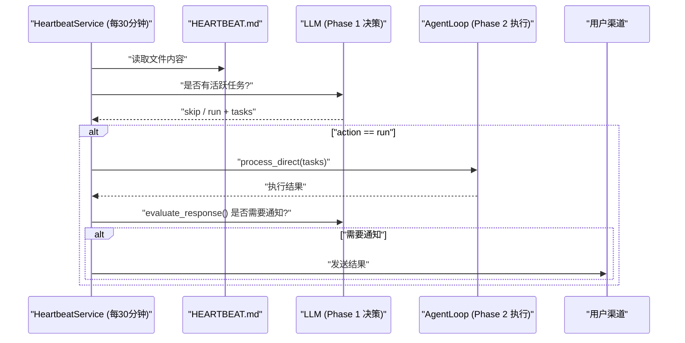

# HEARTBEAT.md
`HEARTBEAT.md` 是 nanobot 定期任务系统的核心配置文件，由 `HeartbeatService` 驱动。

## 文件内容

工作区中的 `HEARTBEAT.md`（初始模板来自 `nanobot/templates/HEARTBEAT.md`）是一个用户可编辑的 Markdown 文件，用于描述需要定期执行的任务：

```markdown
## Active Tasks
- [ ] Check weather forecast and send a summary
- [ ] Scan inbox for urgent emails
```

## 执行流程

`HeartbeatService` 每 30 分钟（默认）触发一次，执行两阶段处理：

### Phase 1：决策

读取 `HEARTBEAT.md` 后，调用 LLM 判断文件中是否有活跃任务：
- LLM 通过虚拟工具调用（`heartbeat` tool）返回 `action: "skip"` 或 `action: "run"`
- 如果文件为空或只有注释，返回 `skip`，直接结束

### Phase 2：执行

当 Phase 1 返回 `run` 时，通过 `agent.process_direct()` 将任务交给完整的 Agent 循环处理：
- 使用独立的 `session_key="heartbeat"` 会话
- 自动选择最近活跃的渠道（Telegram/Discord 等）作为目标
- 执行完成后保留最近 8 条消息（`keep_recent_messages`）

### 通知决策

执行完成后，通过 `evaluate_response` 评估是否需要通知用户：
- 有实质性结果 → 发送到用户最近活跃的渠道
- 例行状态检查无新内容 → 静默跳过

## 配置

通过 `HeartbeatConfig` 配置：

```json
{
  "gateway": {
    "heartbeat": {
      "enabled": true,
      "interval_s": 1800
    }
  }
}
```

## Agent 如何管理 HEARTBEAT.md

`AGENTS.md` 中明确指示 Agent 使用文件工具管理 `HEARTBEAT.md` [7](#19-6) ：
- 用户说"每天早上检查天气" → Agent 用 `edit_file` 追加任务到 `HEARTBEAT.md`
- 这与 cron 工具不同：cron 用于精确时间点的提醒，HEARTBEAT.md 用于周期性的开放式任务

## 整体架构


