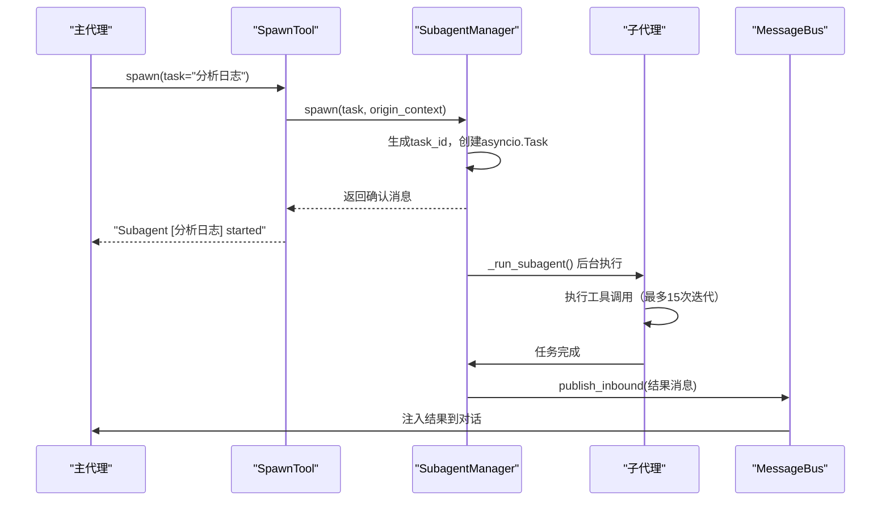

# Subagent 介绍

Subagent 是 nanobot 的后台任务执行系统，允许主代理将长时间运行或复杂的任务委托给独立的后台工作进程。

## 核心概念

Subagent 让主代理能够：
- 通过 `spawn` 工具创建后台任务
- 立即返回确认消息，继续处理其他请求
- 子代理完成后通过消息总线将结果注入回主对话

## 主要组件

### SpawnTool

`SpawnTool` 是主代理调用的接口：

- 使用 `ContextVar` 跟踪原始会话上下文
- 接收 `task` 和可选的 `label` 参数
- 调用 `SubagentManager.spawn()` 创建任务

### SubagentManager

`SubagentManager` 管理子代理的完整生命周期：

- **任务跟踪**：维护 `_running_tasks`、`_task_statuses`、`_session_tasks` 三个字典
- **spawn()**：创建新的子代理任务，生成 8 字符 task_id 
- **_run_subagent()**：实际执行子代理任务


## 执行流程



## 工具限制

子代理使用受限的工具集，防止递归和滥用：

**可用工具**：
- 文件系统：`read_file`、`write_file`、`edit_file`、`list_dir`、`glob`、`grep`
- 系统执行：`exec`（如果启用）
- Web：`web_search`、`web_fetch`（如果启用）

**不可用工具**：
- `spawn` - 防止递归创建子代理
- `message` - 防止直接向用户发送消息
- `cron` - 防止调度定时任务

## 关键特性

### 任务状态跟踪

`SubagentStatus` 实时跟踪任务状态：
- phase: initializing/awaiting_tools/tools_completed/done/error
- iteration: 当前迭代次数
- tool_events: 工具执行历史
- usage: token 使用统计

### 结果通知机制

子代理完成后通过 `_announce_result()` 发送结果：
- 构造系统消息，使用 `subagent_announce.md` 模板
- 通过 MessageBus 发布为 `InboundMessage`
- 使用 `session_key_override` 确保路由到正确的会话

### 会话管理

- 支持按会话取消所有子代理：`cancel_by_session()`
- 统一会话模式下正确路由结果

## 集成方式

在 `AgentLoop` 中初始化并注册 `SpawnTool`：

```python
self.subagents = SubagentManager(...)
# 在 _register_default_tools() 中注册
self.tools.register(SpawnTool(self.subagents))
```

## Notes

- 子代理最大迭代次数限制为 15 次
- 工具执行失败时会报告部分进度
- 支持并发执行多个子代理任务
- 测试覆盖了各种场景，包括任务取消、错误处理等
