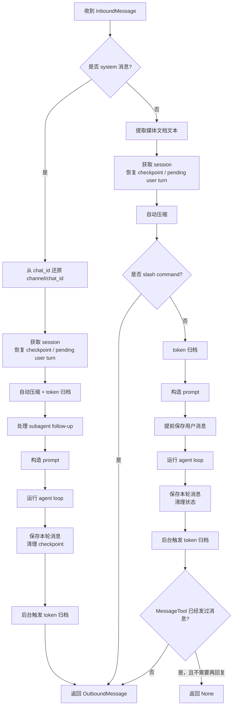

# `_process_message` 执行流程

进入主 agent 处理链路的每条新消息，都会调用 `_process_message`

`_process_message` 可以理解成一句话：

> 它负责把一条收到的消息变成一次完整的 agent 处理流程：恢复会话、整理历史、构造 prompt、运行模型和工具、保存结果、返回回复。


`_process_message` 简化流程图如下：



诊断检查只看到原有的 `loguru` 导入解析警告，和这次注释修改无关。

## 流程说明


它有两条主线：`system消息`和`普通用户消息`。

### 1. system 消息

`system` 消息不是普通用户直接发来的消息，通常来自后台任务、子代理之类的内部流程。

流程是：

```text
收到 system 消息
  -> 从 msg.chat_id 里还原真正的 channel/chat_id
  -> 找到对应 session
  -> 恢复上次中断的运行状态
  -> 自动压缩/归档过长历史
  -> 如果是 subagent 消息，先写入 session
  -> 构造 prompt
  -> 跑 agent loop
  -> 保存本轮结果
  -> 后台再做一次归档
  -> 返回 OutboundMessage
```

这里比较特殊的是 `subagent`：

```python
is_subagent = msg.sender_id == "subagent"
```

如果是子代理的 follow-up，它的内容会先持久化到历史里。后面构造 prompt 时，`current_message` 会传空字符串，避免同一段内容既出现在历史里，又作为当前消息再出现一次。

### 2. 普通用户消息

普通用户消息是主流程。大概是：

```text
收到用户消息
  -> 如果有媒体，先提取文档文本
  -> 找到 session
  -> 恢复中断状态
  -> 自动压缩历史
  -> 如果是 slash command，直接执行命令并返回
  -> token 超限则归档旧消息
  -> 构造 prompt
  -> 提前保存用户消息
  -> 跑 agent loop
  -> 保存 assistant/tool 新消息
  -> 清理 pending/checkpoint
  -> 后台再归档
  -> 决定是否返回最终文本
```

这里最重要的几个点：

`auto_compact.prepare_session(...)`  
先把会话整理到适合继续对话的状态，可能返回一个 `pending` 摘要，后面会注入 prompt。

`maybe_consolidate_by_tokens(...)`  
如果当前 prompt 太长，就把旧消息摘要归档，避免超过模型上下文。

`context.build_messages(...)`  
把历史、当前用户输入、摘要、媒体等拼成真正要发给模型的 messages。

`_run_agent_loop(...)`  
这是核心执行阶段。模型可能会多轮调用工具，也可能流式输出，最后返回 `final_content` 和完整消息链 `all_msgs`。

`_save_turn(...)`  
把本轮新增的 assistant/tool 消息写回 session。用户消息前面已经提前保存了，所以这里会用 `save_skip` 跳过，避免重复保存。

最后那个 `MessageTool` 判断是为了避免重复回复：如果工具已经直接给用户发过消息，而模型最后只返回了一个空占位回复，那 `_process_message` 就返回 `None`，不再额外发一条没意义的消息。

## 如何理解“恢复中断状态”
“恢复中断状态”指的是：上一次处理用户消息时，agent 还没完整结束就停掉了；下一次收到消息前，先把上次没收尾的内容补进 session 历史里，避免历史断裂。

这里主要有两种状态。

第一种是 `runtime_checkpoint`：  
agent 已经跑到中途了，比如模型已经产生了 assistant 消息、已经完成了一些工具调用、还有一些工具调用没完成。代码会把这些“进行中的状态”临时存到 `session.metadata["runtime_checkpoint"]`。如果进程中断，下次启动时 `_restore_runtime_checkpoint` 会把它还原成普通历史消息：

- 已生成的 assistant 消息写回历史
- 已完成的 tool result 写回历史
- 未完成的 tool call 补一条错误结果：`Task interrupted before this tool finished.`

第二种是 `pending_user_turn`：  
用户消息已经提前保存了，但 agent 还没来得及生成回复就中断。下次恢复时，如果发现最后一条还是 `user`，就补一条 assistant 错误消息：

```text
Error: Task interrupted before a response was generated.
```

这样做是为了避免会话历史停在“用户问了，但永远没有回答”的半截状态。

为什么会中断？代码注释里提到几种典型情况：

- 进程 OOM，被系统杀掉
- 收到 `SIGKILL`
- 程序自重启
- 用户执行 stop / 重启 agent
- 工具调用或模型调用过程中服务异常退出

所以“恢复中断状态”不是继续从断点精确运行，而是把上次未完成的一轮对话整理成一段合法历史：已经发生的尽量保留，没完成的用错误消息封口，然后新请求再正常开始。