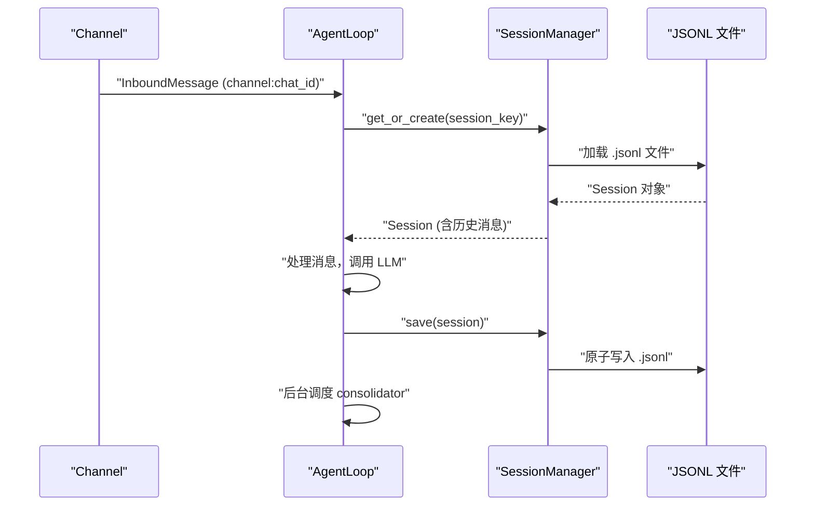

# session 介绍

Session 是 nanobot 的对话历史管理单元，负责持久化每个对话的消息历史和元数据。

## Session 数据结构

`Session` 是一个 dataclass，定义在 `nanobot/session/manager.py`：

| 字段 | 类型 | 说明 |
|------|------|------|
| `key` | `str` | 会话唯一标识，格式为 `channel:chat_id` |
| `messages` | `list[dict]` | 完整消息历史 |
| `created_at` | `datetime` | 创建时间 |
| `updated_at` | `datetime` | 最后更新时间（AutoCompact 用此判断是否过期） |
| `metadata` | `dict` | 扩展元数据（存储 checkpoint、last_summary 等） |
| `last_consolidated` | `int` | 已压缩到 `history.jsonl` 的消息数量 |

## session_key 的生成规则

`session_key` 由 `InboundMessage.session_key` 属性计算：

```python
@property
def session_key(self) -> str:
    return self.session_key_override or f"{self.channel}:{self.chat_id}"
```

不同场景下的 key 格式：

| 场景 | session_key 示例 |
|------|-----------------|
| Telegram 私聊 | `telegram:123456` |
| Telegram 话题群 | `telegram:-100123:topic:42` |
| Slack 线程 | `slack:C123:1700000000.000` |
| 统一会话模式 | `unified:default` |
| Heartbeat 任务 | `heartbeat` |

Telegram 线程的 key 由 `_derive_topic_session_key()` 生成，Slack 线程类似。

## 存储格式

每个 Session 对应工作区 `sessions/` 目录下的一个 JSONL 文件，文件名由 `safe_filename(key.replace(":", "_"))` 生成。

文件格式：
```jsonl
{"_type": "metadata", "key": "telegram:123", "created_at": "...", "updated_at": "...", "metadata": {}, "last_consolidated": 0}
{"role": "user", "content": "hello", "timestamp": "..."}
{"role": "assistant", "content": "hi", "timestamp": "..."}
```

第一行是元数据，后续每行是一条消息。

## 原子写入

`save()` 方法先写临时文件，再用 `os.replace()` 原子替换，防止写入中途崩溃导致文件损坏。关机时可以开启 `fsync=True` 确保数据落盘。

## 损坏修复

`_repair()` 方法在加载失败时逐行解析，跳过损坏的行，恢复有效消息。

## get_history() 方法

`get_history()` 返回发送给 LLM 的消息列表，只返回 `last_consolidated` 之后的未压缩消息，并自动对齐到合法的工具调用边界（避免孤立工具结果）。

## SessionManager

`SessionManager` 管理所有会话，使用内存缓存 + 磁盘持久化：

- `get_or_create(key)` — 从缓存或磁盘加载，不存在则新建
- `save(session)` — 原子写入磁盘并更新缓存
- `invalidate(key)` — 从内存缓存中移除（强制下次从磁盘重新加载）
- `list_sessions()` — 扫描 sessions 目录，只读第一行元数据，按 `updated_at` 倒序返回
- `delete_session(key)` — 删除磁盘文件和缓存

## Session 生命周期


