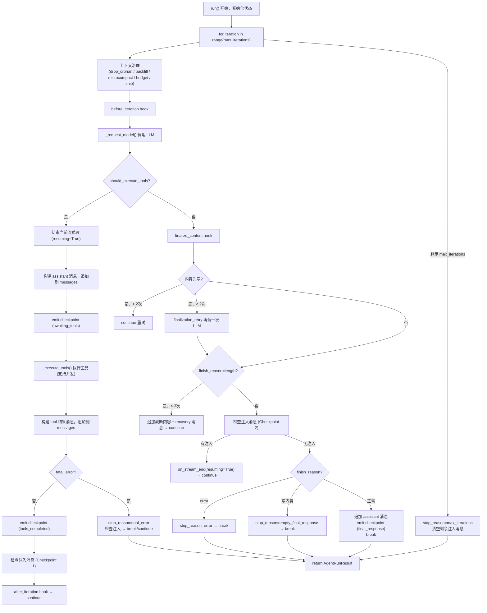

# `AgentRunner.run` 执行流程（详细版）

以下是 `AgentRunner.run` 方法的完整详细介绍：

## 初始化阶段

方法开始时初始化所有状态变量：

```python
messages = list(spec.initial_messages)  # 消息历史副本
final_content = None
tools_used = []
usage = {"prompt_tokens": 0, "completion_tokens": 0}
empty_content_retries = 0   # 空响应重试计数
length_recovery_count = 0   # 长度恢复计数
had_injections = False
injection_cycles = 0        # 注入周期计数
```

---

## 主循环：`for iteration in range(max_iterations)`

每次迭代分为以下几个阶段：

### 阶段一：上下文治理

每次迭代开始时，对 `messages` 做一系列修复和裁剪，生成 `messages_for_model`（只影响发给 LLM 的副本，不改变原始 `messages`）：

| 步骤 | 方法 | 作用 |
|------|------|------|
| 1 | `_drop_orphan_tool_results` | 删除没有对应 tool_call 的孤立工具结果 |
| 2 | `_backfill_missing_tool_results` | 为有 tool_call 但缺少结果的条目补充占位符 |
| 3 | `_microcompact` | 压缩旧的大型工具结果（保留最近10条，超过500字符的可压缩工具结果会被截断） |
| 4 | `_apply_tool_result_budget` | 按 token 预算裁剪工具结果 |
| 5 | `_snip_history` | 裁剪历史以适应上下文窗口 |
| 6 | 再次执行步骤1、2 | 裁剪可能产生新孤立结果，再次清理 |

如果上下文治理失败，回退到只做最小修复（步骤1、2）。

### 阶段二：调用 LLM

触发 `before_iteration` 钩子，然后调用 `_request_model()`：

- 如果 hook 要求流式输出，调用 `provider.chat_stream_with_retry()`，每个 delta 通过 `hook.on_stream()` 推送
- 否则调用 `provider.chat_with_retry()`
- 累计 token 使用量

---

### 分支一：响应包含工具调用（`response.should_execute_tools == True`）

1. **结束当前流式段**（`on_stream_end(resuming=True)`，告知前端还会继续）
2. **构建 assistant 消息**，包含 `tool_calls` 字段，追加到 `messages`
3. **发出 checkpoint**（phase: `awaiting_tools`），记录待执行的工具调用
4. **执行工具**（`_execute_tools()`）：
   - 按批次执行，`concurrent_tools=True` 时同批次并发执行
   - 每个工具调用通过 `_run_tool()` 执行，处理重复外部查找限制、工具不存在、执行异常等情况
5. **构建工具结果消息**（`role: "tool"`），追加到 `messages`
6. **如果有 fatal_error**（`fail_on_tool_error=True` 时）：设置 `stop_reason="tool_error"`，检查注入消息，`break` 或 `continue`
7. **发出 checkpoint**（phase: `tools_completed`）
8. **检查注入消息**（Checkpoint 1）：工具执行后、下次 LLM 调用前
9. 触发 `after_iteration` 钩子，`continue` 进入下一次迭代

---

### 分支二：响应不含工具调用（最终响应）

#### 2a. 空响应处理

如果 `clean`（经 `hook.finalize_content()` 处理后的内容）为空：
- 最多重试 `_MAX_EMPTY_RETRIES = 2` 次（直接 `continue`）
- 超过重试次数后，追加一条 `build_finalization_retry_message()` 再调用一次 LLM（`_request_finalization_retry()`，此时不传工具定义）

#### 2b. 长度截断恢复

如果 `finish_reason == "length"` 且内容非空：
- 最多恢复 `_MAX_LENGTH_RECOVERIES = 3` 次
- 将截断的内容作为 assistant 消息追加，再追加一条 `build_length_recovery_message()`，`continue` 让 LLM 继续生成

#### 2c. 检查注入消息（Checkpoint 2）

在发出流式结束信号之前检查注入：
- 如果有注入消息，`should_continue=True`，流式结束信号带 `resuming=True`，`continue` 继续循环
- 最多允许 `_MAX_INJECTION_CYCLES = 5` 个注入周期

#### 2d. 错误响应

`finish_reason == "error"` 时：设置 `stop_reason="error"`，检查注入消息，`break`

#### 2e. 正常完成

将 assistant 消息追加到 `messages`，发出 checkpoint（phase: `final_response`），设置 `final_content`，`break`

---

## 循环结束：`else` 分支（达到 max_iterations）

Python `for...else` 语法：循环正常耗尽（未 `break`）时执行：
- 设置 `stop_reason="max_iterations"`
- 渲染 `agent/max_iterations_message.md` 模板作为最终内容
- 清空剩余注入消息（避免它们被重新发布为独立消息）

---

## 返回结果

```python
return AgentRunResult(
    final_content=final_content,
    messages=messages,       # 包含完整的本轮消息历史
    tools_used=tools_used,
    usage=usage,
    stop_reason=stop_reason, # "completed" / "tool_error" / "error" / "max_iterations" / "empty_final_response"
    error=error,
    tool_events=tool_events,
    had_injections=had_injections,
)
```

---

## 完整流程图


