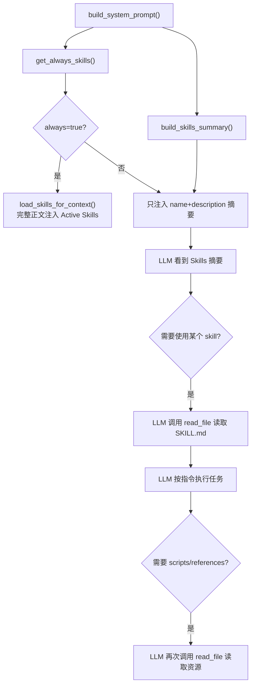

# Skill 的使用机制

## Skill 的结构

每个 skill 是一个目录，包含必须的 `SKILL.md` 文件和可选的资源目录 [1](#28-0) ：

```
skill-name/
├── SKILL.md          (必须) — YAML frontmatter + Markdown 指令
├── scripts/          (可选) — 可执行脚本
├── references/       (可选) — 参考文档
└── assets/           (可选) — 模板、图片等资源
```

`SKILL.md` 的 frontmatter 示例（以内置 `cron` skill 为例） [2](#28-1) ：

```yaml
---
name: cron
description: Schedule reminders and recurring tasks.
---
```

## Skill 的来源

`SkillsLoader` 从两个位置加载 skills，工作区 skills 优先级更高 [3](#28-2) ：

1. **工作区 skills**：`<workspace>/skills/` — 用户自定义
2. **内置 skills**：`nanobot/skills/` — 随包分发

内置 skills 包括：`cron`、`github`、`memory`、`skill-creator`、`tmux`、`weather` 等。

## 渐进式加载（三级系统）

Skill 使用三级加载策略管理上下文窗口 [4](#28-3) ：

| 级别 | 内容 | 何时加载 |
|------|------|---------|
| Level 1 | `name` + `description` | **始终**在系统提示中 |
| Level 2 | `SKILL.md` 正文 | LLM 判断需要时，用 `read_file` 读取 |
| Level 3 | `scripts/`、`references/`、`assets/` | 按需由 LLM 主动读取 |

## 注入系统提示的方式

`ContextBuilder.build_system_prompt()` 将 skills 以两种方式注入 [5](#28-4) ：

### 1. Always Skills（完整内容注入）

标记了 `always: true` 的 skills，其完整正文直接注入到系统提示的 `# Active Skills` 部分：

```python
always_skills = self.skills.get_always_skills()
always_content = self.skills.load_skills_for_context(always_skills)
parts.append(f"# Active Skills\n\n{always_content}")
```

### 2. 普通 Skills（摘要注入）

其余 skills 只注入 name + description 摘要到 `# Skills` 部分，并告知 LLM 通过 `read_file` 读取完整内容 [6](#28-5) ：

```markdown
# Skills
The following skills extend your capabilities. To use a skill, read its SKILL.md file using the read_file tool.

- **cron** — Schedule reminders and recurring tasks.  `/path/to/cron/SKILL.md`
- **github** — ...
```

## Requirements 检查

Skill 可以声明依赖的命令行工具或环境变量，不满足时在摘要中标记为 `(unavailable)` [7](#28-6) ：

```yaml
metadata:
  nanobot:
    requires:
      bins: ["ffmpeg"]
      env: ["OPENAI_API_KEY"]
```

## Skill 的创建

有两种方式创建新 skill：

1. **Dream 自动创建**：Dream Phase 2 识别重复工作流后，通过 `write_file` 工具创建新 skill [8](#28-7) 
2. **手动创建**：使用内置的 `skill-creator` skill，通过 `init_skill.py` 脚本初始化模板 [9](#28-8) 

## 完整流程图


